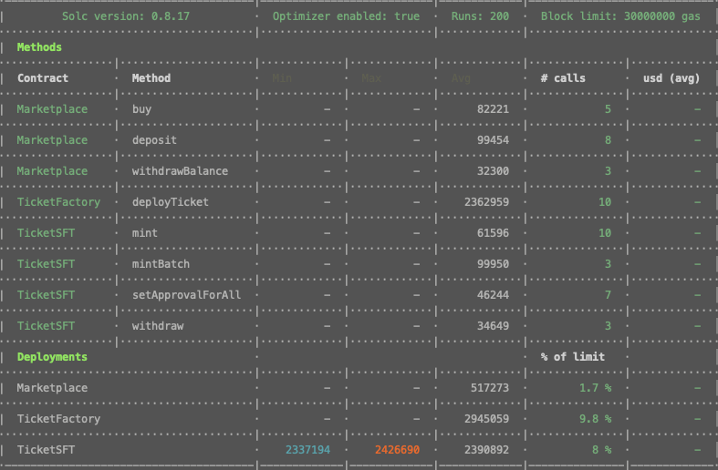
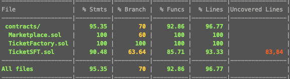
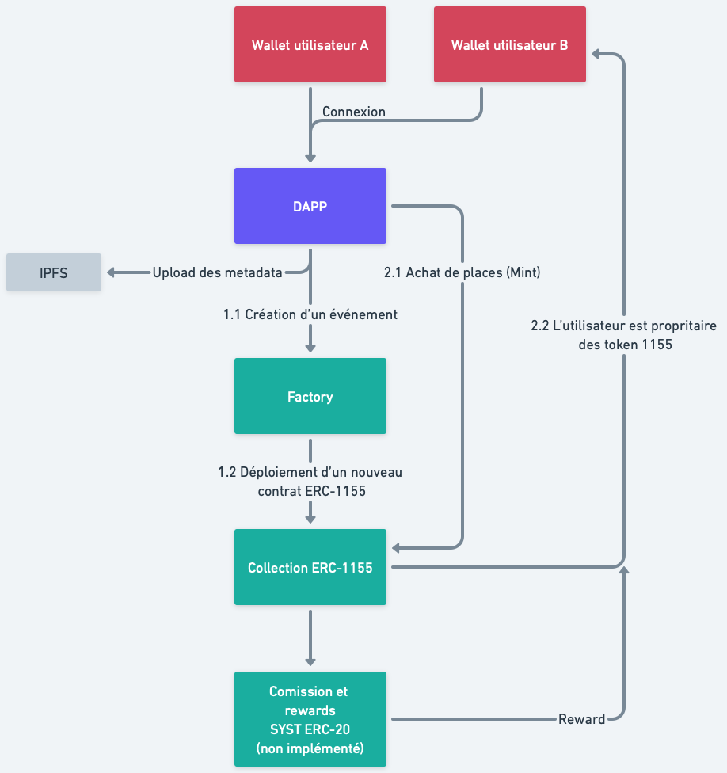
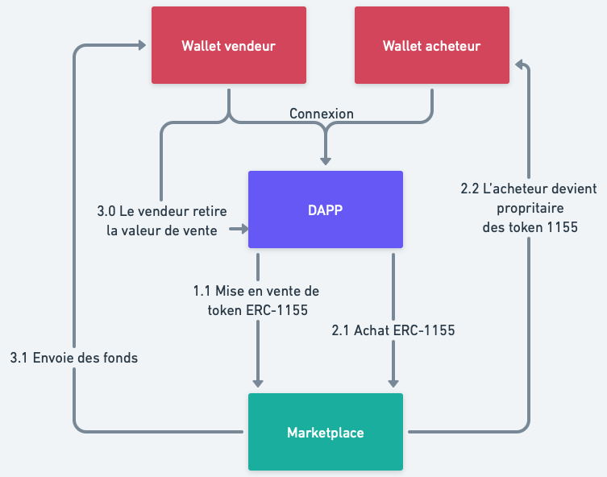

# Share Your Seat

- Video: https://drive.google.com/file/d/19e_71eay-Wdk2N3Cw__KUSM8b6QkxSG6/view?usp=share_link
- App: https://share-your-seat.vercel.app/
- TicketFactory (Mumbai): 0x14C6208225D2407fE4b6f223b23CEfDe4E318Bfd
- Marketplace (Mumbai): 0x23C022ceF4bbA9D640b25aDF62118ecc99dB12b3

## Front

### Run

```bash
cd client
npm i
npm run dev
```

### Hooks

- `client/contexts/TicketFactory/Provider.tsx` : Utilisé pour intéragir avec `TicketFactory.sol`
- `./client/hooks/useCollection.ts` : Utilisé pour intéragir avec `TicketSFT.sol`
- `./client/hooks/useMarketplace.ts` : Utilisé pour intéragir avec `Marketplace.sol`

### Env file (`./client/.env`)

```env
NEXT_PUBLIC_TICKET_FACTORY_ADDRESS=0x...
NEXT_PUBLIC_TICKET_MARKETPLACE_ADDRESS=0x...
ALCHEMY_ID=...
```

## Hardhat

### Env file (`./hardhat/.env`)

```env
MUMBAI_ID=...
PRIVATE_KEY=0X...
REPORT_GAS=true
```

## Tests

### Gas reporter



### Coverage



### Run tests (make sure to have `npx hardhat node` running)

```bash
cd hardhat
npx hardhat test
```

## Stack

- [Typescript](https://www.typescriptlang.org)
- [NextJS](https://nextjs.org/)
- [Tailwind](https://tailwindcss.com/) & [DaisyUI](https://daisyui.com/)
- [Rainbowkit](https://www.rainbowkit.com/)
- [EthersJS](https://ethers.org/)
- [Wagmi](https://wagmi.sh/)
- [Vercel](https://vercel.com/home)
- [Hardhat](https://hardhat.org/)
- [React-toastify](fkhadra.github.io/react-toastify)

## Schémas

### TicketFactory.sol & TicketSFT.sol



### Marketplace.sol


